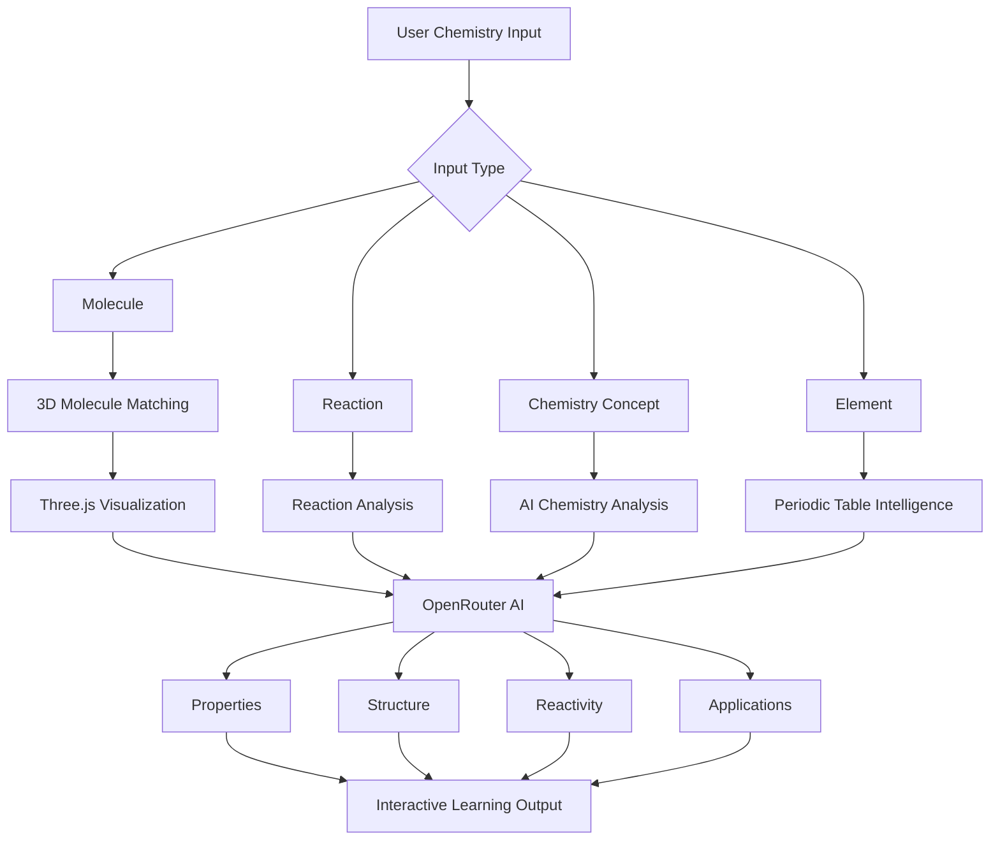

<p align="center">
  
</p>

<div align="center">

# ChemVirtualLab AI


### AI Chemistry Laboratory • 3D Molecules • Virtual Experiments • Reaction Simulation • AI Tutor


<br>


</div>

---

## Project Preview

<a href="https://www.loom.com/share/136fd478e1314e5d947b15ed86243428" target="_blank">


</a>

👉 [Click here to watch full screen demo](https://www.loom.com/share/136fd478e1314e5d947b15ed86243428)

---

# Overview

ChemVirtualLab AI is an advanced AI-powered virtual chemistry laboratory designed to combine interactive scientific learning, 3D molecular visualization, reaction simulation, chemistry calculations, spectroscopy, crystal structures, adaptive quizzes, and AI-assisted chemistry analysis within one immersive platform.

The application is built using Streamlit, Three.js WebGL, Plotly, NumPy, SciPy, and OpenRouter AI. It provides a futuristic chemistry workspace where users can explore chemical concepts, visualize molecular structures, perform virtual experiments, simulate reactions, analyse spectroscopy data, solve stoichiometry problems, and interact with an AI Chemistry Tutor. :contentReference[oaicite:0]{index=0}

---

# Project Identity

| Property | Details |
|---|---|
| Project Name | ChemVirtualLab AI |
| Version | 3.0 / ChemVerse Universe v4.0 Interface |
| Project Type | AI-Powered Virtual Chemistry Laboratory |
| Application Framework | Streamlit |
| 3D Engine | Three.js WebGL |
| AI Provider | OpenRouter |
| Visualization | Plotly |
| Scientific Computing | NumPy and SciPy |
| Organization | Navneet Education Limited |
| Developer | Snehal Laxman Jadhav |
| Role | AI Engineer |

---

# Core Features

- AI Chemistry Tutor
- Virtual Chemistry Laboratory
- Interactive 3D Molecule Viewer
- Molecule Builder
- Periodic Table Explorer
- Reaction Simulator
- Stoichiometry Suite
- Spectroscopy Laboratory
- Crystal Structure Viewer
- Organic and Inorganic Chemistry Studio
- Adaptive Quiz Station
- AI Molecular Analysis
- Real-Time Chemistry Visualization
- Interactive WebGL Models
- AI Experiment Generation
- Chemistry XP Gamification
- Multiple AI Reasoning Models
- Chemistry Concept Analysis

---

# ChemVerse Universe

ChemVirtualLab AI introduces an interactive ChemVerse Universe where major chemistry modules are represented as explorable worlds.

```text
CHEMVERSE UNIVERSE
        │
        ├── Element Galaxy
        │
        ├── Molecule World
        │
        ├── AI Nexus
        │
        ├── Reaction Arena
        │
        ├── Virtual Lab
        │
        ├── Quiz Nexus
        │
        ├── Spectrum World
        │
        ├── Crystal Realm
        │
        ├── Calculation World
        │
        ├── Molecule Builder
        │
        └── Gas Law World
```

The universe map uses Three.js and interactive WebGL rendering with animated planets, orbit paths, labels, particle systems, zooming, and drag-based navigation. :contentReference[oaicite:1]{index=1}

---

# AI Chemistry Workflow



---

# AI Chemistry Input

Users can type molecules or chemistry concepts directly into the main interface.

Examples:

```text
water
benzene
H2SO4
sodium chloride
acetylene
glucose
carbon dioxide
ammonia
ethanol
```

The system attempts to match the input to a pre-built molecular model and automatically creates a 3D visualization.

If a pre-built model is unavailable, the application switches to AI analysis mode.

---

# AI Deep Analysis

The AI Chemistry Assistant can analyse a molecule using the following structure:

```text
1. Identity
2. Official Name
3. Chemical Formula
4. Chemical Class
5. 3D Structure
6. Molecular Geometry
7. Bond Angles
8. Hybridization
9. Physical Properties
10. Chemical Properties
11. Reactivity
12. Applications
```

OpenRouter is used to generate structured chemistry analysis and AI-powered explanations. :contentReference[oaicite:2]{index=2}

---

# AI Chemistry Models

The application supports multiple reasoning models through OpenRouter.

The interface includes selectable AI models and reasoning-capable chemistry workflows.

The uploaded project references:

- NVIDIA Nemotron reasoning model
- OpenAI GPT-OSS reasoning model
- OpenRouter AI Gateway

These models support AI chemistry analysis, explanations, equation solving, and interactive tutoring. :contentReference[oaicite:3]{index=3}

---

# Virtual Chemistry Lab

The Virtual Lab provides chemistry simulations for:

- Acid-Base Chemistry
- pH Calculations
- Boyle's Law
- Charles's Law
- Van der Waals Equation
- Gas Laws
- Strong Acid Titration
- Weak Acid Titration
- Electrochemistry
- Nernst Equation
- Gibbs Free Energy
- Enthalpy
- Entropy
- Chemical Kinetics
- Zero-Order Reactions
- First-Order Reactions
- Second-Order Reactions

---

# 3D Molecule Viewer

The 3D Molecule Viewer supports interactive molecular visualization.

Features include:

- Ball-and-Stick Models
- CPK-Inspired Atom Colors
- Dynamic Lighting
- Interactive Rotation
- Mouse Drag
- Touch Rotation
- Scroll Zoom
- Molecular Bond Rendering
- Particle Background
- Neon Atom Glow
- Molecular Information Panel
- Geometry Information
- Hybridization
- Polarity
- Molecular Weight

---

# Supported Molecules

The uploaded application includes molecular definitions for:

| Molecule | Formula |
|---|---|
| Water | H₂O |
| Methane | CH₄ |
| Ammonia | NH₃ |
| Carbon Dioxide | CO₂ |
| Benzene | C₆H₆ |
| Ethanol | C₂H₅OH |
| Hydrogen Chloride | HCl |
| Sodium Chloride | NaCl |
| Sulfuric Acid | H₂SO₄ |
| Glucose | C₆H₁₂O₆ |
| Nitric Acid | HNO₃ |
| Sodium Hydroxide | NaOH |
| Oxygen | O₂ |
| Nitrogen | N₂ |
| Hydrogen Peroxide | H₂O₂ |
| Acetylene | C₂H₂ |

:contentReference[oaicite:4]{index=4}

---

# Molecule Information

For supported molecules, the application can display:

- Chemical Formula
- Molecular Geometry
- Hybridization
- Polarity
- Molecular Weight
- Boiling Point
- Melting Point
- Atomic Structure
- Molecular Bonds

---

# Live 3D Molecule Preview

The home page includes an interactive Three.js molecule viewer.

Supported preview molecules include:

```text
H₂O
CH₄
C₆H₆
CO₂
NH₃
C₂H₅OH
```

Users can switch between molecules without leaving the main laboratory interface.

---

# Molecule Builder

The Molecule Builder provides an interactive environment for constructing molecular structures.

Capabilities include:

- Atom-Based Construction
- Molecular Structure Creation
- Bond Visualization
- Interactive 3D Models
- AI Bond Analysis
- Chemistry Structure Exploration

---

# Periodic Table

The Periodic Table module includes:

- All 118 Elements
- Element Exploration
- Element Properties
- Electron Configuration
- Periodic Trends
- AI Experiment Generation
- AI Property Explanation

---

# Reaction Simulator

The Reaction Simulator provides:

- Reaction Equation Analysis
- Equation Balancing
- Matrix-Based Balancing
- AI Reaction Type Prediction
- Reaction Visualization
- Animated Particle Reactions
- Reaction Database
- Chemical Transformation Analysis

---

# Spectroscopy Lab

The Spectroscopy Laboratory includes:

- Infrared Spectroscopy
- IR Peak Identification
- Proton NMR
- Chemical Shift Analysis
- Mass Spectrometry
- Fragmentation Analysis
- UV-Visible Spectroscopy
- Beer-Lambert Law
- AI Spectrum Interpretation

---

# Stoichiometry Suite

The Stoichiometry Suite supports:

- Mole Calculations
- Molecular Weight
- Limiting Reagent
- Percentage Yield
- Dilution Calculations
- Concentration
- Solution Chemistry
- Colligative Properties
- Reaction Quantities
- AI Calculation Assistance

---

# Crystal Structure

The Crystal Structure module provides interactive visualization for:

- Simple Cubic
- Body-Centered Cubic
- Face-Centered Cubic
- Diamond Structure
- Bravais Lattices
- Atomic Packing
- Unit Cells
- AI Crystal Analysis

---

# Organic and Inorganic Studio

The Organic / Inorganic Studio provides dedicated chemistry exploration for:

- Organic Compounds
- Inorganic Compounds
- Functional Groups
- Molecular Structure
- Bonding
- Reactions
- Chemical Properties
- AI Chemistry Explanations

---

# Quiz Station

The adaptive Quiz Station provides:

- AI-Generated Questions
- Multiple Chemistry Topics
- Multiple Difficulty Levels
- Chemistry Knowledge Assessment
- Interactive Learning
- Gamification
- XP Rewards

---

# ChemVerse XP Gamification

The application includes a chemistry-learning XP system.

Example levels include:

| Level | Rank |
|---|---|
| Level 1 | Atom Apprentice |
| Level 2 | Molecule Cadet |
| Level 3 | Lab Explorer |
| Level 4 | Reaction Master |
| Level 5 | Chemistry Sage |
| Level 6 | Quantum Alchemist |

The XP interface tracks user progress across chemistry modules. :contentReference[oaicite:5]{index=5}

---

# Quantum Atomic Model

The main interface includes an interactive Three.js quantum-style atomic visualization featuring:

- Animated Nucleus
- Multiple Electron Shells
- Electron Orbits
- Glow Effects
- Particle Fields
- Dynamic Lighting
- Drag Rotation
- Scroll Zoom
- Multi-Color Quantum Effects

---

# System Architecture

```text
                           User
                             │
                             ▼
                    Streamlit Interface
                             │
          ┌──────────────────┼──────────────────┐
          │                  │                  │
          ▼                  ▼                  ▼
    Virtual Lab        3D Visualization      AI Tutor
          │                  │                  │
          ▼                  ▼                  ▼
      NumPy/SciPy       Three.js/Plotly      OpenRouter
          │                  │                  │
          └──────────────────┼──────────────────┘
                             ▼
                   Chemistry Intelligence
                             │
          ┌──────────────────┼──────────────────┐
          ▼                  ▼                  ▼
     Molecules          Reactions           Concepts
          │                  │                  │
          └──────────────────┼──────────────────┘
                             ▼
                  Interactive Learning Output
```

---

# Application Modules

```text
ChemVirtualLab AI

├── Universe Home
├── Virtual Lab
├── AI Chat Lab
├── 3D Molecules
├── Periodic Table
├── Quiz Station
├── Reaction Simulator
├── Spectroscopy Lab
├── Stoichiometry Suite
├── Crystal Structure
├── Molecule Builder
└── Organic / Inorganic Studio
```

:contentReference[oaicite:6]{index=6}

---

# Technology Stack

| Layer | Technology |
|---|---|
| Programming Language | Python |
| Web Framework | Streamlit |
| AI Gateway | OpenRouter |
| AI Reasoning | NVIDIA Nemotron / GPT-OSS |
| 3D Engine | Three.js WebGL |
| Interactive Charts | Plotly |
| Scientific Computing | NumPy |
| Numerical Methods | SciPy |
| Data Processing | Pandas |
| Image Processing | Pillow |
| UI Components | Streamlit Components |
| Styling | HTML and CSS |
| Browser Rendering | JavaScript and WebGL |

The requirements file includes Streamlit, Plotly, Pandas, NumPy, Requests, SciPy, Pillow, and Streamlit Extras. :contentReference[oaicite:7]{index=7}

---

# Project Structure

```text
ChemVirtualLabAI/
│
├── app.py
├── requirements.txt
├── README.md
├── .env
│
├── pages/
│   ├── 1_Virtual_Lab.py
│   ├── 2_AI_Tutor.py
│   ├── 3_Molecule_3D.py
│   ├── 4_Periodic_Table.py
│   ├── 5_Quiz_Station.py
│   ├── 6_Reaction_Simulator.py
│   ├── 7_Spectroscopy_Lab.py
│   ├── 8_Stoichiometry_Suite.py
│   ├── 9_Crystal_Structure.py
│   ├── 10_Molecule_Builder.py
│   └── 11_Organic_Inorganic_Studio.py
│
├── utils/
│   ├── styles.py
│   └── openrouter_ai.py
│
└── assets/
```

---

# Requirements

```txt
streamlit>=1.60.0
plotly>=5.20.0
pandas>=2.0.0
numpy>=1.26.0
requests>=2.31.0
scipy>=1.12.0
Pillow>=10.0.0
streamlit-extras>=0.4.0
```

:contentReference[oaicite:8]{index=8}

---

# Environment Configuration

Create a `.env` file:

```env
OPENROUTER_API_KEY=your_openrouter_api_key
```

Additional model configuration can be maintained inside the OpenRouter utility module.

Never expose real API credentials inside source code or commit them to GitHub.

---

# Installation

Clone the repository:

```bash
git clone https://github.com/yourusername/ChemVirtualLabAI.git
```

Navigate to the project:

```bash
cd ChemVirtualLabAI
```

Create a virtual environment:

```bash
python -m venv .venv
```

Windows:

```bash
.venv\Scripts\activate
```

Linux or macOS:

```bash
source .venv/bin/activate
```

Install dependencies:

```bash
pip install -r requirements.txt
```

Run the application:

```bash
streamlit run app.py
```

Open:

```text
http://localhost:8501
```

---

# AI Chemistry Example

Example input:

```text
benzene
```

The application can provide:

```text
Chemical Name
Formula
Molecular Geometry
Hybridization
Polarity
Molecular Weight
Boiling Point
Melting Point
3D Molecular Structure
AI Chemistry Analysis
Reactivity
Applications
```

---

# Chemistry Visualization Features

- Rainbow Neon Interface
- Interactive WebGL
- 3D Molecules
- Animated Electron Shells
- Particle Systems
- Dynamic Lighting
- Space-Themed Chemistry Universe
- Molecular Glow Effects
- Interactive Zoom
- Drag Rotation
- Chemistry Data Cards
- AI Analysis Panels

---

# Educational Capabilities

ChemVirtualLab AI can support learning in:

- General Chemistry
- Physical Chemistry
- Organic Chemistry
- Inorganic Chemistry
- Analytical Chemistry
- Spectroscopy
- Stoichiometry
- Chemical Kinetics
- Thermodynamics
- Electrochemistry
- Molecular Geometry
- Crystal Chemistry

---

# Application Highlights

- 118 Element Periodic Table
- 3D Chemistry Worlds
- Multiple Molecular Models
- AI Reasoning Models
- Virtual Chemistry Simulations
- Interactive Chemistry Calculators
- Spectroscopy Tools
- Reaction Balancing
- AI Experiment Generation
- Gamified Chemistry Learning
- Real-Time Molecular Visualization

---

# Security Recommendations

- Keep OpenRouter API keys in `.env`
- Never hardcode production API keys
- Do not commit `.env`
- Rotate exposed credentials immediately
- Restrict production API usage
- Use environment-specific configuration
- Add authentication if deployed publicly
- Enable rate limiting for AI requests

---

# Future Enhancements

- PubChem API Integration
- SMILES-to-3D Generation
- RDKit Integration
- Protein Structure Viewer
- Molecular Dynamics
- Quantum Chemistry Simulation
- Orbital Visualization
- Reaction Mechanism Animation
- AI Lab Report Generation
- Voice Chemistry Tutor
- AR Molecular Viewer
- VR Chemistry Laboratory
- Multi-Language Chemistry Tutor
- Collaborative Classroom Mode
- Teacher Dashboard
- Student Performance Analytics
- Advanced Chemical Safety Module
- Real-Time Molecular Optimization
- Chemistry Knowledge Graph
- AI Research Assistant

---

# Navneet AI Engineering Project

ChemVirtualLab AI demonstrates how Artificial Intelligence, scientific computing, real-time 3D graphics, and interactive visualization can be combined into a modern educational chemistry environment.

The project brings together:

- Artificial Intelligence
- Chemistry Education
- Scientific Computing
- 3D WebGL Graphics
- Interactive Simulation
- Molecular Visualization
- Gamification
- AI Tutoring
- Chemistry Data Exploration

It is designed as an AI engineering project focused on making chemistry more interactive, visual, intelligent, and engaging.

---

# Developed By

## SNEHAL LAXMAN JADHAV

### AI Engineer

### Navneet Education Limited

---

# License

Internal, educational, research, or repository-owner-defined use.

---

<div align="center">

# ChemVirtualLab AI

### Explore. Experiment. Discover. Learn.

### AI-Powered Chemistry Laboratory

**Python • Streamlit • OpenRouter • Three.js • Plotly • NumPy • SciPy • WebGL**

<br>


<br><br>

### Developed by

# SNEHAL LAXMAN JADHAV

### AI Engineer

### Navneet Education Limited

</div>

<p align="center">
  
</p>
